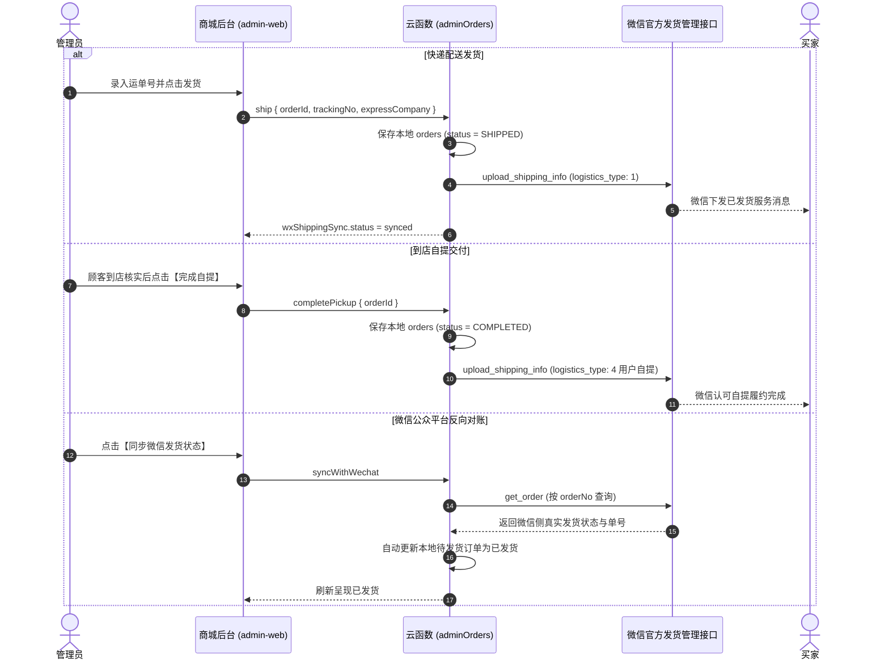

# 微信小程序全功能电商商城开源模板 (WeChat Mini Program Mall Template)

> **基于微信原生小程序 (TypeScript) + 微信云开发 (CloudBase Node.js) + React 18 PC 管理后台构建的商业级开源商城全套解决方案。**

---

## 📖 项目简介

本项目是一套结构清晰、商业逻辑闭环、安全规范严格的**微信小程序电商商城开源模板**。项目原生支持多配色 SKU 规格矩阵、购物车结算、收货地址管理、极速快递配送与到店自提双履约模式，并深度整合了**微信支付 API v3 真实交易链路**与**微信小程序官方「发货信息管理服务」双向同步**，同时配备现代化的 Web 端管理后台，可作为企业自营商城、品牌线上店或独立开发者电商二开项目的通用脚手架。

---

## ✨ 核心特性一览

- **🛒 完整的商城前台体验 (Native Mini Program)**：
  - 首页轮播营销大图、潮流活动专区卡片（ZONE）、快捷分类导航与瀑布流推荐。
  - 商品详情页价格展示、卖点提炼、规格对照参考与多图画廊。
  - 多配色 $\times$ 多规格动态联动 SKU 规格弹窗，严格防超卖。
  - 购物车全选/反选、数量加减、实时价格计算与滑动删除。
  - 确认订单页：支持「极速快递包邮」与「到店自提」两种互斥履约模式，收货地址智能识别与默认选中。
  - 个人中心：全状态订单列表（待付款、待发货、待自提、运输中、已完成）。
- **💳 微信支付 API v3 规范集成**：
  - 纯自包含实现，采用官方推荐的 RSA-SHA256 签名算法，无需依赖厚重第三方包。
  - JSAPI 预下单（`/v3/pay/transactions/jsapi`）获取 `prepay_id`，生成前端调起支付所需 `paySign` 5 参数。
  - 支付回调通知解密验签（AEAD_AES_256_GCM），自动流转订单状态并写入交易流水表。
  - 严格服务端超时取消与未支付订单库存自动回退。
- **📦 微信官方「发货信息管理服务」双向同步**：
  - **商城后台 $\rightarrow$ 微信**：后台发货即时调用微信 `/wxa/sec/order/upload_shipping_info` 上报，同步推送买家微信物流通知。
  - **微信后台 $\rightarrow$ 商城后台**：服务端调用微信 `/wxa/sec/order/get_order` 反向对账，检测到微信端发货自动同步更新本地单号。
  - **物流单号冲突检测**：两侧物流信息不一致时主动报警拦截，杜绝静默覆盖，提供人工裁决仲裁。
  - **到店自提真实履约**：自提订单自动按微信官方「用户自提」（`logistics_type: 4`）上报对账，严禁虚假单号。
- **💻 现代化 PC 管理后台 (admin-web)**：
  - 基于 React 18 + Vite + TypeScript 构建，极简现代设计。
  - 涵盖商品管理、SKU 库存即时调整、分类管理、轮播与专区图文更换、订单履约发货与冲突核对。
- **☁️ 云开发与安全架构**：
  - 微信私钥支持 Base64 服务端环境变量托管，源代码与 Git 仓库 100% 零密钥接触。
  - 细粒度角色与权限校验（RBAC），敏感管理接口严格服务端凭证核验。

---

## 🛠️ 技术栈清单

| 模块 | 技术选型 | 说明 |
| :--- | :--- | :--- |
| **小程序前端** | Native WXML + WXSS + TypeScript | 微信原生框架，轻量零臃肿 |
| **服务端 / 云函数** | WeChat CloudBase (Node.js 18+) | 18 个微模块化云函数，事务与权限封装 |
| **云数据库** | CloudBase NoSQL Document DB | 分布式高并发，字段灵活扩展 |
| **管理后台前端** | React 18 + TypeScript + Vite | 快速构建，现代 UI 与极速 HMR |
| **支付协议** | WeChat Pay API v3 (RESTful) | RSA-SHA256 签名 + AES-GCM 解密 |

---

## 📁 项目目录结构

```text
Mall-MiniProject/
├── miniprogram/                 # 微信小程序原生前端源码
│   ├── components/              # 通用组件 (product-card, promo-card, category-nav, etc.)
│   ├── pages/                   # 页面模块
│   │   ├── home/                # 商城首页
│   │   ├── category/            # 分类浏览
│   │   ├── goods/detail/        # 商品详情 (多规格选择与履约模式)
│   │   ├── cart/                # 购物车
│   │   ├── checkout/            # 结算确认订单
│   │   ├── order/detail/        # 订单详情 (支持 ${商品订单号} 跳转)
│   │   └── profile/             # 个人中心与订单列表
│   ├── services/                # 前端服务层与云调用封装
│   ├── config/                  # 品牌与门店自定义配置
│   ├── app.json / app.ts        # 小程序全局路由与生命周期
│   └── project.config.json      # 开发者工具工程配置
├── cloudfunctions/              # 微信云开发云函数 (18 个独立模块)
│   ├── common/                  # 公共底层库 (wxOrderShippingService, commerce, auth)
│   ├── payment/                 # 微信支付 API v3 统一下单与签名
│   ├── paymentCallback/         # 微信支付官方异步回调通知解密与订单入账
│   ├── orders/                  # 客户端订单创建、查询与取消
│   ├── adminOrders/             # 管理端发货、微信对账与自提核销
│   ├── orderTimeoutJob/         # 定时器：超时关单与发货状态增量反向巡检
│   ├── products/ / adminProducts# 商品检索与管理端 CRUD
│   └── ...                      # 其他业务云函数
├── admin-web/                   # PC 网页管理控制台 (React + Vite)
│   ├── src/pages/               # 订单履约、商品管理、轮播营销、库存流水
│   └── src/api/client.ts        # 管理后台 API Client
├── docs/                        # 架构与数据规范文档
│   ├── database-schema.md       # 数据库 Collection 字段与索引清单
│   └── DEPLOYMENT.md            # 云开发环境迁移与部署手册
├── scripts/                     # 运维与工程化脚本
│   ├── bundle-functions.js      # 云函数 common 模块自动化独立打包同步工具
│   ├── init-db.js               # 数据库集合与索引结构生成器
│   └── seed-demo-data.js        # 演示环境虚拟数据准备
├── .env.example                 # 服务端环境变量配置模板
├── SECURITY.md                  # 安全政策与私钥保护指南
├── CONTRIBUTING.md              # 开源贡献指南
└── LICENSE                      # MIT 开源许可证
```

---

## 🚀 快速开始与部署教程

只需以下 7 个步骤，即可在您的微信开发者工具与 CloudBase 环境中跑通全套项目：

### 第一步：克隆仓库与初始化

```bash
git clone https://github.com/violetLemons/Mall-MiniProject.git
cd Mall-MiniProject

# 安装小程序开发工具依赖
npm install

# 安装 PC 管理后台依赖
cd admin-web && npm install && cd ..
```

### 第二步：配置小程序 AppID 与本地工程

1. 打开根目录下的 `project.config.json`；
2. 将 `"appid": "wxYOUR_MINIPROGRAM_APPID"` 修改为您在 [微信公众平台](https://mp.weixin.qq.com) 申请的小程序真实 AppID；
3. 打开微信开发者工具，选择「导入项目」，目录指向本项目根目录。

### 第三步：开通腾讯云开发环境 (CloudBase)

1. 在微信开发者工具顶部工具栏点击 **「云开发」** 并开通环境（记录您的环境 ID，如 `my-mall-env-xxxx`）；
2. 打开 `miniprogram/services/cloud.ts`，将环境 ID 替换为您刚开通的环境：
   ```typescript
   export const CLOUD_ENV_ID = 'my-mall-env-xxxx';
   ```

### 第四步：创建数据库集合与索引

登录微信开发者工具「云开发」控制台 $\rightarrow$ **数据库**，新建以下核心集合（权限与索引设置请参考 [docs/database-schema.md](docs/database-schema.md)）：

- `users`、`admins`、`products`、`product_skus`、`categories`
- `carts`、`addresses`、`orders`、`order_items`、`pickup_points`
- `banners`、`payment_transactions`、`inventory_logs`、`operation_logs`

### 第五步：同步公共依赖并部署云函数

在项目根目录下执行打包脚本，将 `common` 业务层自动分发至各云函数目录：

```bash
# 1. 运行依赖打包工具
node scripts/bundle-functions.js

# 2. 在微信开发者工具中部署
# 右键点击 cloudfunctions 下的每一个云函数目录，选择【上传并运行：云端安装依赖 (不上传 node_modules)】
```

> **必选核心部署清单**：
> `products`, `orders`, `payment`, `paymentCallback`, `adminOrders`, `orderTimeoutJob`, `adminAuth`, `adminGateway`, `adminProducts`, `adminCategories`, `adminBanners`, `adminInventory`, `cart`, `addresses`, `pickupPoints`。

### 第六步：配置云开发环境变量 (微信支付与密钥)

打开「云开发控制台」$\rightarrow$ **云函数** $\rightarrow$ **环境配置** $\rightarrow$ **环境变量**，参考 `.env.example` 填入如下变量：

| 变量名 | 必填 | 示例值 / 说明 |
| :--- | :--- | :--- |
| `WECHAT_APP_ID` | 是 | 您的微信小程序 AppID |
| `WECHAT_APP_SECRET` | 是 | 微信小程序 AppSecret（用于服务端发货管理接口） |
| `CLOUDBASE_ENV_ID` | 是 | 您的云开发环境 ID |
| `WECHAT_PAY_MCH_ID` | 是 | 微信支付商户号（10 位纯数字） |
| `WECHAT_PAY_CERT_SERIAL_NO` | 是 | 商户 API 证书序列号（大写十六进制字符串） |
| `WECHAT_PAY_API_V3_KEY` | 是 | 微信支付商户平台设置的 32 位 APIv3 密钥 |
| `WECHAT_PAY_PRIVATE_KEY_BASE64` | 是 | 将 `apiclient_key.pem` 全文转换为 Base64 后的单行文本 |
| `WECHAT_PAY_NOTIFY_URL` | 是 | 接收微信支付回调的云函数 HTTP 访问触发地址 |

> [!TIP]
> **私钥转换为 Base64 命令**：
> - Windows: `[Convert]::ToBase64String([IO.File]::ReadAllBytes("apiclient_key.pem"))`
> - Mac/Linux: `base64 -w 0 apiclient_key.pem`

### 第七步：编译预览与真机测试

1. 在微信开发者工具中点击 **「编译」**；
2. 点击 **「预览」** 扫描二维码即可在真机上体验完整的选品、加购、地址选择、到店自提与支付发货对账流程。

---

## 📦 微信小程序官方发货管理与 Path 配置

### 1. 微信公众平台订单详情 Path 标准配置

在微信公众平台后台：
> **支付与交易** $\rightarrow$ **订单管理** $\rightarrow$ **订单信息录入** $\rightarrow$ **小程序商品订单详情 path**

请填入如下标准动态路径：
```text
pages/order/detail/index?orderNo=${商品订单号}
```
- **工作机制**：在用户完成支付后，微信服务消息与交易中心卡片会携带 `${商品订单号}` 回跳本小程序，订单详情页内置了多参数兼容解析器，确保毫秒级命中对应订单。

### 2. 发货与自提双向同步运作流程



---

## ❓ 常见问题 (FAQ)

#### Q1: 微信支付提示 `PEM routines:get_name:no start line` 错误？
**A**: 这是由于私钥在环境变量中换行符丢失导致的。请严格按照本文档说明，将 `apiclient_key.pem` 文件内容先进行 Base64 编码，并填入 `WECHAT_PAY_PRIVATE_KEY_BASE64` 环境变量，服务端代码已内置自动 Base64 解码与 PEM 标准多行补全引擎。

#### Q2: 微信后台提示“请先开发商品详情页，提审后再配置 path”？
**A**: 这是微信公众平台的准入门禁。微信要求小程序必须提交一个包含电商类目（如“商家自营 > 百货/服装”）的审核版本，平台系统验证小程序确有实物商品详情交易链路后才开放该配置项。直接提交当前代码审核即可解除。

#### Q3: 自提订单为什么没有提货核销码？
**A**: 校园与门店自提场景下，买家已在微信完成实名支付。让买家现场翻找 6 位验证码体验极差，且易发生误输堵塞柜台。本项目严格遵循微信官方免密自提模式，买家出示小程序订单详情或凭手机号即可提货，管理员在后台一键完成核销并同步微信对账。

---

## 🛡️ 安全注意事项

- 生产部署前请通读 [SECURITY.md](SECURITY.md)。
- 严禁将任何包含真实商户私钥、证书（`.pem`、`.p12`）或 AppSecret 的文件提交至公开 Git 仓库。
- 首次上线建议使用 ¥0.01 真实交易进行小额验证。

---

## 📄 开源许可证

本项目采用 [MIT 许可证](LICENSE)。欢迎自由使用、修改并衍生用于商业或非商业项目。
