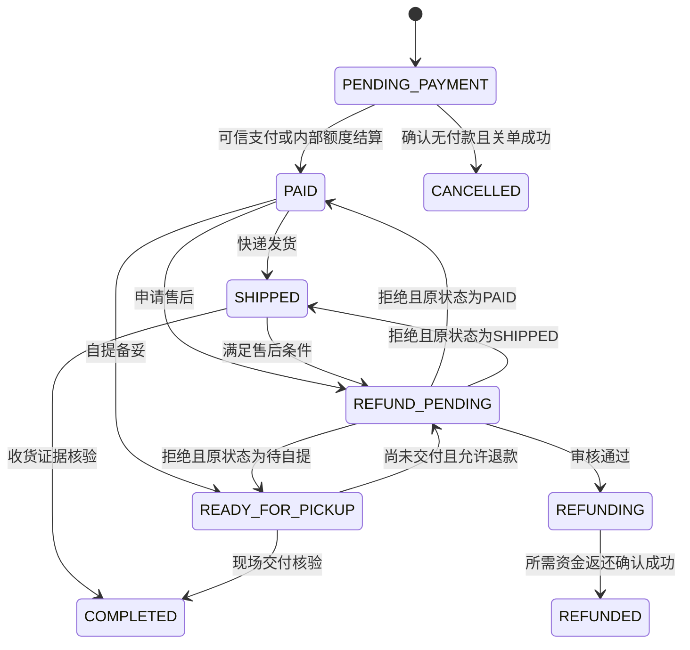

# Mall-MiniProject 单商户改造与上线补全书

版本：1.0；日期：2026-10-09（Asia/Hong_Kong）  
源码审计基线：`d03f3d2fb834305f8dc0f503333d061b0b8d7a52`  
决策及验收台账：[accepted.md](accepted.md)

> 本书是已完成的审计和实施方案，供后续修改与上线执行使用。用户确认本轮只写改造书，业务代码尚未改造，当前项目不满足本书上线条件。用户最新指令优先；已有计划书作为参考。文中“目标、应、拟新增”均表示待实施，不是现有能力保证。

## 1. 最终目标与已确认决策

最终形态：一个自营商家、一套普通微信支付商户号、一个小程序买家端、一个管理员网页端。后台只保留 `SUPER_ADMIN`。订单不再按商品或商家拆出商户子单。

| 决策 | 已确认结论 | 具体落地 |
| --- | --- | --- |
| D1 订单模型 | A：统一 `orders` | 下单、支付、列表、详情、取消、发货、自提、收货、退款和评价都引用同一个 `orderId/orderNo` |
| D2 审核工单 | 删除商户工单 | 管理员直接维护商品；移除 `product_audit_tickets`、工单 API 和页面；微信内容安全审核独立保留 |
| D3 抽成/商户号 | 普通商户号 + API v3 直连；删除抽成和分账 | 商品价只取 SKU 售价；去掉 `platformFee`、`merchantId`、`subMchIdEnc`、`WECHAT_PAY_SUB_MCH_ID`；保留 `WECHAT_PAY_MCH_ID` |
| D4 角色 | 仅 `SUPER_ADMIN` | 管理端登录、所有管理函数均拒绝其它角色；商户账号和旧凭证退役，不自动升级权限 |
| D5 历史数据 | 可丢弃测试数据，重新初始化 | 不开发真实历史订单合并迁移；优先在明确选择的空生产环境初始化，旧测试环境隔离保留至新环境验收 |

“统一订单主表”不等于只允许一个数据库集合。`payment_transactions`、`refund_records` 和必要的明细/额度流水必须保留，以便幂等和对账。

本轮未获得的上线资料：实际品类、主体及认证状态、用户提到的微信详细文档位置。不能根据种子里的水果、README 里的服装或“个人版云环境”推断实际经营品类或小程序主体。

## 2. 对原计划书的审核与修正

已按用户要求依次读取 `docs/转变单商户计划书.md`、`docs/database-schema.md`、`docs/DEPLOYMENT.md`、`README.md`，再针对指定六类范围核对源码。复用现有 `common/commerce`、支付请求实现、`wxOrderShippingService`、打包/部署脚本和测试框架，不重新设计整套商城。

| 原计划问题 | 本书修正 |
| --- | --- |
| 把“删除商户字段”等同于支付改造完成 | 当前下单/主动查单是 API v3，回调/关单还是 CloudPay；必须统一整个支付通道并补验签、解密、真实退款 |
| 只改 `.ts/.wxml/.wxss/.json` 的表述覆盖所有目录 | 该规则适用于小程序；后端与脚本 `.js`、后台 `.tsx` 是源码。后续实施须明确此作用域，小程序编译产物和函数 `common` 副本不手改 |
| `merchantAuth` 删除依赖小程序删除，小程序删除又依赖认证删除 | 本地按后端→小程序拓扑修改；停止商户使用后统一部署切换，旧云端函数显式退役，避免循环依赖 |
| T6.3 将数据迁移放在部署尾部且可选 | D5 已选重新初始化；目标环境、数据隔离、备份和回滚在部署前完成，不在生产边运行边删集合 |
| 去商户隔离后继续允许任意角色/通配权限 | 先收紧后台鉴权为超管，再去 `merchantId` 分支。否则旧商户 JWT 可能获得全店权限 |
| 删除商品工单没有描述内容安全 | 商户工单和微信安全审核是两件事；评价、昵称、头像等应走微信支持的内容安全能力 |
| 多处写 `merchantId=null` | 新契约不再写这个字段；兼容读仅限明确标记的短期过渡，最终源码、种子和数据库清单移除 |
| 文档声称库存事务与 35 项测试全部通过 | 当前库存核心已移除；实际测试 11/35 通过。按真实业务重新明确库存策略和测试契约，不照抄成功声明 |
| 部署手册要求六位自提码，README 宣称免码核销 | 实际后端没有校验自提码。自提证据方式需要业务确认；“微信强制免码”的说法没有本次官方依据 |
| 最终只做一次全链路回归 | 每阶段做对应回归；核心漏洞自审最多两轮，阶段回归与官方联调仍必须执行 |

## 3. 定向差距审计

### 3.1 分级与证据边界

- **严重**：资金真伪、订单核心一致性、管理员身份可绕过，必须阻断上线。
- **高**：直接影响交易可靠性、越权、微信必要合规或有效验收，发布前必须解决。
- **中**：上线可用性、对账覆盖、运营可观测性等缺口，本任务要求补全。
- **低**：交接、清理和一致性问题，随本次改造修正。

代码证据为基线文件及行号。云端环境变量、安全规则、商户授权和真实交易未直接查看，相关条目明确标记“待云端核验”，不将文档推荐等同于线上漏洞已经发生。

### 3.2 严重问题

| ID | 问题及触发条件 | 代码证据 | 必须修复与验收 |
| --- | --- | --- | --- |
| C01 | 执行退款时没有调用微信，直接写 `REFUNDED/SUCCESS`，现金实际未退 | `cloudfunctions/adminOrders/index.js:249`、`:270` | 真正申请退款，处理中保留 `REFUNDING`，仅微信已验签通知或已验证查询的退款成功结果可记现金成功；真机原路退款对账 |
| C02 | API v3 主动查单只判断 `trade_state=SUCCESS`，未核对金额、AppID、商户号、付款人和订单号；非事务更新且重复增销量/写流水 | `cloudfunctions/payment/index.js:489`、`:493`、`:519`；响应解析 `:315` | 统一证据校验和事务入账；错误金额/主体全部拒绝；回调与查询并发只入账一次；成功响应也验签 |
| C03 | 买家取消直接改本地主单/子单并返还额度，没有微信查单、关单；已发起支付时可能取消已付款订单 | `cloudfunctions/orders/index.js:433`、`:448`、`:461` | 买家、后台、超时任务复用同一取消服务；查单未知拒绝取消，付款成功先入账，关单确认后才取消并返额度 |
| C04 | 多处 JWT 缺配置时采用同一固定回退密钥；鉴权接受 `event.adminJwtSecret` 注入 | `common/crypto.js:2`、`common/authMiddleware.js:10`、`adminAuth/index.js:33`、`adminGateway/index.js:184`（均在 `cloudfunctions/` 下） | 删除所有固定密钥和事件注入路径；各函数独立环境变量配置；缺失时拒绝服务；轮换密钥并使旧会话失效 |
| C05 | 旧密码哈希兼容分支中存在特殊口令，可绕过对应账号真实密码并覆盖哈希 | `cloudfunctions/adminAuth/index.js:36`、`:37` | 删除特殊口令；遗留哈希只允许验证原密码；有效账号错误密码、旧哈希、伪哈希都做负向测试；不在记录中复制口令 |
| C06 | 商户 `devLogin` 按用户名/商户 ID 直接签发 JWT，未做密码验证或环境限制 | `cloudfunctions/merchantAuth/index.js` 的 `devLogin` 与 `issueMerchantToken` | 删除前端和本地函数后，还要删除/禁用线上函数及旧商户账号；直调旧函数、复用旧 token 均失败 |
| C07 | API v3 直连通知与当前回调不匹配：现回调从事件顶层取单号，查 CloudPay，未处理 API v3 HTTP 通知验签及资源解密 | `cloudfunctions/paymentCallback/index.js:9`、`common/payGateway.js:8` | 实现直连原始 HTTP 回调、微信公钥/平台证书验签、AES-GCM 解密与规范应答；按实际公网地址发送官方通知并入账 |

### 3.3 高问题

| ID | 问题及证据 | 补全要求 |
| --- | --- | --- |
| H01 | 下单后删除请求中的任意 `cartId`，未校验归属与 SKU，错误被吞掉；`orders/index.js:313` | 事务内校验 `userId/skuId/count`，他人购物车不得读取、删除或减少；只扣减实际购买数量 |
| H02 | 额度余额 `Number()` 后直接参与计算，没有安全整数校验；现金退款与抵扣额度未分账；`orders/index.js:190`、`adminOrders/index.js:253` | 全链路整数分、两种退款金额单独记录、不可超原支付；拟补额度账本，扣减/返还与订单状态同事务，防重复返还 |
| H03 | 同一请求 ID 直接返回旧订单，没有请求内容指纹；缺 ID 则服务端随机生成；`orders/index.js:94`、`:121` | 客户端保存一次逻辑下单的请求 ID；服务端强制要求并绑定商品、数量、地址、自提、额度意图等指纹；不同内容复用 ID 拒绝 |
| H04 | 收货、申请退款、退款审批的“检查状态→更新”分散且不全在事务中；重复发货可再次追加同一包裹；`orders/index.js:494`、`:517`、`adminOrders/index.js:220`、`:194` | 事务/CAS 状态流转；退款申请幂等且审批决策严格枚举；发货请求与运单幂等，拒绝退款中发货 |
| H05 | 微信官方收货闭环缺失：买家确认收货只更新本地；未发现 `openBusinessView/notifyConfirmReceive` 接入 | 接官方 `weappOrderConfirm`，回到小程序后服务端 `get_order` 再核验；本地完成不代表微信资金结算完成 |
| H06 | 上报和重试没有明确区分首次发货、网络重试和重新发货；官方有更新/重新发货次数限制；`common/wxOrderShippingService.js:294`、`:339` | 保存上报指纹与结果，未知结果先查微信；守住包裹数量和重发机会；修正掩码联系格式，未知物流编码拒绝默认伪映射 |
| H07 | 没有发现文本/图片内容安全接口；评价直接写评论，昵称/头像直接存；`orders/index.js:542`、`auth/index.js:129` | 用户文本用 `security.msgSecCheck`，媒体按官方能力异步检测；通过后公开，待复核/失败不直接展示；管理员商品内容另核可用场景，不能伪造用户 openid |
| H08 | 买家端没有找到完整隐私指引入口及授权接入；只有商户组件处理隐私错误 | 按真实信息收集配置公众平台指引；声明手机号、地址、头像等实际用途；官方默认弹窗或官方授权组件二选一完整实现并真机验收 |
| H09 | Schema 推荐买家自行读写 `users/orders`，用户余额与订单敏感字段不应可客户端改；部署示例又用 `_openid`，业务以 `userId` 为主 | 云端实际规则待核验；建议交易、额度及用户敏感写入全部服务端私有；使用真实客户端做直读直写负向验收 |
| H10 | `initDb` 导出入口未见调用者鉴权；生产误部署可能被调用初始化；`cloudfunctions/initDb/index.js:253` | 初始化只在受控环境执行；生产不长期暴露；后台登录限流当前被注释，也须恢复（`adminAuth/index.js:13`） |
| H11 | 删除商户隔离但不收紧角色会让旧商户 token 获全店权限；`common/authMiddleware.js:23` 允许通配或权限字符串 | `requireAdmin` 必须校验 `role===SUPER_ADMIN`；改角色、停用、改密和退役都会话失效；不得仅依赖前端隐藏路由 |
| H12 | 广告奖励可直接调用 `ads.reward` 得额度，未见可信观看完成证据；发放流水事务外失败可丢失；`ads/index.js:75`、`:119` | 首发建议保持禁用；启用前按官方可用广告能力验证证明、幂等、日限额和流水；不将前端完成标志作为资金凭证 |
| H13 | 现测试 35 项仅 11 项通过，部分 mock/库存/订单标识已过时 | 更新既有测试去调用实际生产入口；保留攻击用例；不要删失败用例或放宽断言来刷通过 |
| H14 | 商户双表、抽成、角色、工单贯穿两端；已有“去页面”不能消除后台残留 | 数据、公共服务、函数、路由、类型、种子、部署清单和云端逐阶段清理；`merchant_orders` 不再产生 |
| H15 | 主体/类目/资质/商户授权未验证；文档给服装类目但种子为食品类 | 品类按实际经营填写，申请对应类目和资质，核 AppID/商户绑定、交易管理授权、支付主体能力；不套用演示品类 |
| H16 | 微信发货查单请求沿用录入接口的 `order_key` 嵌套结构；且 `order_state>=2` 就认作已发货，把“已退款”等状态混入履约；`common/wxOrderShippingService.js:225`、`:499` | 查询按官方顶层 `transaction_id` 或 `merchant_id+merchant_trade_no` 构造；状态显式映射，退款不发货、自提未交付不直接完成；真实接口和退款边界回归 |

表内省略 `cloudfunctions/` 的后端路径均以该目录为根。

### 3.4 中、低问题

| ID/级别 | 问题 | 处理 |
| --- | --- | --- |
| M01 中 | 客服页“在线客服”只 Toast（`miniprogram/pages/service/index.ts:24`），个人中心相同入口却拨电话（`profile/index.ts:751`） | 用官方 `button open-type="contact"` 真正打开小程序客服会话，后台绑定客服人员；真实热线和营业时间；取消授权/平台不支持时有可用替代 |
| M02 中 | 未找到业务 `wx.reportEvent/reportAnalytics` 埋点 | 用微信原有上报能力接浏览→加购→下单→支付漏斗，后台看得到；财务成功以服务端流水为准 |
| M03 中 | 定时器每次最多 50 单；发货对账只取最新 10 个候选，可能长期遗漏旧失败单；`orderTimeoutJob/index.js:11`、`:29` | 有界分页、重试游标/`nextRetryAt`、失败单告警；实际验证触发器已创建，代码有配置不等于云端已生效 |
| M04 中 | 自提无核验码，而部署文档要求六位码；后台 `verifyPickupCode` 实际丢弃码（`admin-web/src/api/client.ts:398`） | 用户确认自提核验方式；现场证据、核验人/时间及同单幂等都记录，不制造微信强制免码说法 |
| M05 中 | 下单 v3 金额先取整并至少为 1 再验证，隐藏坏数据；`payment/index.js:363` | 拒绝非安全整数/负数；0 分仅走额度内部结算且幂等，不能把异常额夹成 1 分 |
| M06 中 | 购物车价只用 SKU，旧下单价加抽成；`cart/index.js:111`、`orders/index.js:161` | D3 后统一服务端 SKU 计价，结算页以服务端最新报价确认；禁用商品/变价明确提示 |
| M07 中 | `cloudbaserc`、部署脚本函数清单不一致；有 `ads/initDb/merchantAuth` 配置，脚本遗漏部分；后台保留测试付款退款 API | 建立一份生产函数清单并同步全部入口；新退款/消息函数注册；生产不部署测试入口，后台不展示测试按钮 |
| L01 低 | 原文集合数量、函数数量、库存/规格、自提和“已打通”描述失真 | 由实施后的清单生成数量；修改 README/Schema/部署手册；历史文档加被本书取代标识 |

### 3.5 交易链覆盖结论

| 链路 | 当前情况 | 本次实施必须覆盖 |
| --- | --- | --- |
| 商品/购物车 | 已有商品与购物车服务，可复用；定价契约不同 | 单价同源、下架/失效处理、购物车归属与部分购买 |
| 结算/下单 | 服务端查 SKU、有事务入口；存在随机幂等与非事务降级 | 服务端总价、额度可用量、指纹幂等、无事务拒绝执行 |
| 支付/回调 | v3 下单已写；回调仍 CloudPay | v3 全链路、HTTP 验签解密、统一证据入账、查单补偿 |
| 发货/自提 | 已有微信上报、冲突处理和自提操作 | 单主单适配、真实包裹、重试/重发分开、自提证据 |
| 收货 | 本地完成已有，官方收货未闭环 | 微信组件、返回后服务端核验、微信结算状态独立记录 |
| 退款 | 申请/审批界面已有，现金执行 TODO | 真申请、通知/查询、现金+额度分别对账、幂等终态 |
| 评价 | 已有评分/文本写入 | 订单归属、仅符合条件订单、一次性评价、内容安全 |

## 4. 目标数据与核心逻辑契约

### 4.1 数据集合与金额

保留 `users/admins/products/product_skus/categories/banners/carts/addresses/pickup_points/orders/payment_transactions/refund_records/operation_logs/auth_limits`，以及经确认仍使用的卡密等集合。`order_items` 已在原项目存在，可保留作查询/快照用途，但必须与订单快照同事务写入，不能形成第二套订单状态。

删除 `merchant_orders/product_audit_tickets` 及商户索引。拟增加 `balance_transactions` 记录购物额度变化；微信同步任务优先在 `orders.wxShippingSync` 中维护，确有队列需求才增加独立任务集合。清单以实施后的 `scripts/init-db.js` 为准，禁止按旧文档“固定 20 集合”盲建。

| 订单字段 | 目标语义 |
| --- | --- |
| `_id/orderNo/userId` | 唯一订单 ID、唯一商户订单号、微信上下文获取的买家 openid |
| `items[]` | 下单时商品和 SKU 快照，含名称、规格、图片、整数分单价/数量/小计；无商户归属和抽成 |
| `totalAmount` | 应付总额（商品额 + 经确认的运费 - 经确认的优惠），安全整数分 |
| `balanceAmount/payAmount` | 购物额度抵扣/微信现金实付；两者之和等于 `totalAmount`；不将二者混作同一现金 |
| `status/version` | 唯一业务状态、乐观并发版本；避免 `orderStatus/paymentStatus` 多份可独立修改的状态源 |
| `payment` | 通道、商户号、AppID、微信交易号、支付尝试状态和确认时间；内部 0 分结算与微信分开 |
| `shipments/wxShippingSync` | 包裹列表；同步状态、指纹、最后错误、尝试次数、下次重试时间、确认/结算证据 |
| `refund` | 当前售后 ID、申请前业务状态、现金/额度各自累计退款额；具体请求记录在 `refund_records` |
| `requestId/requestFingerprint` | 同一逻辑下单只生成一次 ID；参数变化用新 ID，旧 ID 不同指纹报冲突 |
| `reviewed/reviewStatus` | 是否已提交评价及审核状态；审核失败不能直接公开 |
| `expireAt/createdAt/updatedAt` | 服务端时间；过期仅表示需要关单，不表示微信必未付款 |

金额与余额必须 `Number.isSafeInteger` 并校验范围。只在展示时转元；后端不接收客户端单价、实付额或退款额作为最终金额。现有卡密/广告额度是否属于优惠额度、可否提现及有效期须用户确认，本书不擅自引入充值或提现。

索引至少包括：订单号唯一；用户+状态+创建时间；待付款状态+过期时间；同步状态+下次重试时间；支付交易号唯一；退款单号唯一；额度操作业务键唯一；管理员用户名唯一。允许空值的唯一索引须按 CloudBase 实际规则验证，内部额度结算用独立业务键，不能复用空微信交易号。

敏感集合推荐客户端 `read=false/write=false`，经云函数鉴权访问；商品也优先用既有查询云函数，避免公开数据库暴露未上架信息。若保留客户端直读，必须按实际存储字段校验归属与公开状态，不能照搬 `_openid` 模板。

### 4.2 支付、额度与退款不变量

1. 一笔订单只允许一次成功支付入账；回调、查单、补偿和零现金结算最终进入同一事务服务。
2. v3 支付证据核对 `appid/mchid/out_trade_no/transaction_id/payer.openid/amount.total/currency/trade_state`。金额匹配微信现金实付 `payAmount`，不是抵扣前总额。
3. `requestPayment.success` 或前端回跳只触发刷新/查单，不能直接标记付款成功。
4. 额度在下单事务扣减并记录流水。取消只返一次；不因重复回调、重复管理员点击或失败重试再次入账。
5. 退款请求固定 `out_refund_no`，重试不能换号；现金累计退款不得超过微信实际支付，额度累计返还不得超过原抵扣。
6. v3 退款请求的 `amount.total` 是原微信现金支付总额，`amount.refund` 是本次现金退款额；0 现金订单不调微信退款。
7. 微信受理退款不等于退款成功。仅可信成功结果确认资金终态；`PROCESSING/ABNORMAL/CLOSED` 分开处理并告警，不显示“已到账”。
8. 为避免一半返额度一半现金失败，先持久化申请并明确各通道状态；额度返还与本地终态记账事务幂等。现金成功、本地记账失败时由同退款号查询补偿，不再发新退款。
9. 财务流水不可吞错后返回业务成功；任何外部调用结果不确定时保留处理中，并安排查询和人工对账。

例如订单 10000 分，额度 3000 分，微信实付 7000 分，整单退回微信 7000 分和额度 3000 分。不能向微信申请退 10000 分。部分退款、运费退款和已发货退货条件属于待确认业务规则，实施前固化；首发建议先实现整单售后，建议不等于用户已批准。

### 4.3 订单状态流转



每个状态写入必须在事务内重新读状态和版本；支付发起/关单请求用持久化操作锁与尝试状态协调。外部微信请求不能放在会重试的数据库事务内。

取消算法：获得取消操作权→同通道查支付→成功则入账并拒绝取消→未支付则同通道关单→确认关单结果→事务复核版本并取消/返额度。网络超时和未知状态保留待核实，不擅自取消。支付发起须先持久化尝试状态并复核取消锁，禁止异步“随手标记”造成并发漏检。

退款拒绝回到保存的 `previousStatus`，不能只用有无 `shippedAt` 猜状态。退款中不得发货或自提核销。超时任务、买家取消、后台取消共用同一服务。完成后评价不改变财务状态。

微信发货同步和结算状态与本地业务状态分开。例如真实已发货但微信上报失败时，保留本地发货事实并显示待同步；不能为重试而再次发货。自提现场完成也不自动代表微信资金已结算。

### 4.4 权限契约

- 买家身份只从 `cloud.getWXContext().OPENID` 获取；订单、地址、购物车、评价和退款每条都核 `userId`。请求传入的 openid 无效。
- 后台每个函数独立验 JWT、有效管理员、`SUPER_ADMIN` 角色和会话版本。HTTP 网关不是唯一鉴权屏障。
- 生产 `ADMIN_JWT_SECRET` 无默认值；所有相关函数单独配置同一有效密钥，禁止通过请求事件传播密钥。角色/密码/停用变更使会话失效。
- 商户账号停用、商户云函数退役、轮换密钥后再去隔离分支；新管理员只能受控创建，不能把旧 MERCHANT 数据批量升权。
- 支付回调与微信消息回调各用其官方验证机制，不能混用后台 JWT。微信消息的 Token/AES 配置与 API v3 密钥是不同用途。

## 5. 微信原有接口优先的接入清单

本节按 2026-10-09 官方页面核对。微信开放文档经网页工具访问失败后，通过官方 HTTPS 页面直接读取；不是第三方教程结论。主体能力、授权和真实调用仍须用实际账号确认。

### 5.1 支付 API v3 直连

复用现有 RSA 请求签名实现，统一为公共支付客户端；按官方签名规则补齐应答验签、回调验签、解密、超时和脱敏错误处理。引入支付依赖前核对官方支持状态、实际接口覆盖和维护成本。

| 操作 | 官方能力/接口路径 | 项目落点 |
| --- | --- | --- |
| 小程序下单 | `POST /v3/pay/transactions/jsapi` | `payment.createPayment`，金额和付款人只读服务端订单 |
| 查询支付 | `GET /v3/pay/transactions/out-trade-no/{orderNo}?mchid=...` | 统一 `common/payGateway`，取消/超时/买家刷新共用 |
| 关闭订单 | `POST /v3/pay/transactions/out-trade-no/{orderNo}/close` | 同一个普通商户号，删除 CloudPay 关单分支 |
| 申请退款 | `POST /v3/refund/domestic/refunds` | `adminOrders.executeRefund` 调统一服务，固定退款号 |
| 查询退款 | `GET /v3/refund/domestic/refunds/{out_refund_no}` | 回调遗漏/网络未知时补偿 |
| 支付通知 | 下单 `notify_url` | `paymentCallback` 改成真实 HTTP 通知入口 |
| 退款通知 | 退款申请 `notify_url` | 拟新增 `refundCallback`，注册配置、部署脚本及 HTTP 触发器 |

微信通知使用请求头 `Wechatpay-*` 和原始 body 验签，再用 API v3 密钥解密资源；校验通知对应订单与金额。只有完成持久化接收或事务处理后才成功应答，避免返回成功后丢失通知。日志仅保留事件 ID、业务号和脱敏结果。[支付通知官方说明](https://pay.wechatpay.cn/doc/v3/merchant/4012791861)、[退款通知官方说明](https://pay.wechatpay.cn/doc/v3/merchant/4012791865)。

公钥模式与平台证书模式按真实商户配置选择，建立 ID/序列号映射和轮换流程。拒绝探测签名与未知签名材料；不能“解密成功就视为验签成功”。查单和退款的成功响应也须验证真实性。[JSAPI 开发指引](https://pay.wechatpay.cn/doc/v3/merchant/4012791870)。

### 5.2 发货、官方收货与资金结算

复用 `common/wxOrderShippingService.js` 的快递、自提、对账、冲突处理。删掉主子单聚合，用 `orders` 中的真实包裹直接上报。[发货信息管理服务官方总说明](https://developers.weixin.qq.com/miniprogram/dev/platform-capabilities/business-capabilities/order-shipping/order-shipping.html)。

| 接口/能力 | 接入方式与目标 |
| --- | --- |
| `upload_shipping_info` / `wxa.sec.order.uploadShippingInfo` | 官方云调用可用；后台记录真实发货后上报；快递类型 1、自提类型 4；不伪造虚拟商品或单号 |
| `get_order` / `wxa.sec.order.getOrder` | 查询使用顶层 `transaction_id` 或 `merchant_id+merchant_trade_no`，不是发货录入的 `order_key`；官方收货组件回跳后再次核验 |
| `get_order_list` | 对账辅助，保留增量和分页；不能替代单笔支付金额校验 |
| `notify_confirm_receive` / `wxa.sec.order.notifyConfirmReceive` | 已有可靠快递签收事实后提醒用户确认，按官方限制每单一次；它不代用户确认收货 |
| `wx.openBusinessView({businessType:'weappOrderConfirm'})` | 买家订单页打开官方收货组件；传可信交易号或商户号+订单号；回跳后后端查 `get_order` |
| `is_trade_managed` | 服务端查询是否开通发货管理；按接口页核接入方式 |
| `is_trade_management_confirmation_completed` | 服务端 REST 查询交易结算管理确认；当前官方明确不支持云调用，不能照搬 `cloud.openapi` |
| `set_msg_jump_path` | 接官方组件后配置消息跳转；按平台当前规则验证买家详情路径，不能假定 README 的占位变量必然适用 |

具体限制及验收：

- 支付号/商户订单号必须来自同笔真实交易；`payer.openid` 是原买家。
- 单订单多个包裹仍是单商户单主单，按实际统一或分拆发货；保存包裹幂等 ID，当前接口分拆上限按官方页执行。
- 顺丰等所需联系人使用掩码格式并保留末四位；不能填虚构联系人。物流编码按官方运力列表，不把未知公司一律当顺丰。
- 网络未知先查微信再重试；已完成上报后的修改属于受限制的重新发货，不能把“重试”按钮做成无限修改通道。
- 对账冲突由管理员看两侧证据后裁决，保留操作日志；禁止静默覆盖真实单号。
- 官方确认收货取消/失败保持原状态，success 回跳也需后端核验。0 现金内部订单没有微信支付单号，不能伪造交易调用官方收货组件。
- `get_order` 的 `order_state` 显式区分待发货、已发货、确认收货、交易完成、已退款、资金待结算。禁止用 `>=2` 推导已交付；自提上报事实和用户收货/交易完成证据分别处理。[查询订单官方字段](https://developers.weixin.qq.com/miniprogram/dev/server/API/order_shipping/api_getorder)。

依据：[发货录入](https://developers.weixin.qq.com/miniprogram/dev/server/API/order_shipping/api_uploadshippinginfo)、[官方收货组件](https://developers.weixin.qq.com/miniprogram/dev/platform-capabilities/business-capabilities/order-shipping/order-shipping-half.html)、[收货提醒](https://developers.weixin.qq.com/miniprogram/dev/server/API/order_shipping/api_notifyconfirmreceive)、[交易管理确认](https://developers.weixin.qq.com/miniprogram/dev/server/API/order_shipping/api_istrademanagementconfirmationcompleted)。

拟新增统一微信消息入口 `wechatEvents`，接内容安全异步结果以及 `trade_manage_remind_shipping/trade_manage_order_settlement` 等交易事件；按[微信消息推送官方机制](https://developers.weixin.qq.com/miniprogram/dev/framework/server-ability/message-push)验证签名、解密、持久化及幂等。消息不是直接改本地付款状态的凭证。此入口与 API v3 支付/退款回调分开。

### 5.3 隐私、内容安全、客服和埋点

| 项目 | 使用官方能力 | 接入要求与验收 |
| --- | --- | --- |
| 隐私 | `getPrivacySetting/openPrivacyContract`；官方默认弹窗或 `onNeedPrivacyAuthorization/agreePrivacyAuthorization` 自定义接入 | 公众平台填写真实指引；买家能随时查看；同意、拒绝、再次授权均真机测试；拒绝后仍允许不需隐私的浏览 |
| 用户文本 | `cloud.openapi.security.msgSecCheck` 或对应 REST | 昵称场景 1、评价场景 2，当前 v2；真实且满足接口访问条件的 openid；`pass/review/risky` 分流，不能只看 errcode=0 |
| 用户媒体 | `security.mediaCheckAsync` 或 REST | 提交后保持待审核，凭 `trace_id` 匹配 `wxa_media_check` 消息；链接在检测期可下载；失败/超时不公开 |
| 管理员商品内容 | 按官方支持的内容/场景校验，配管理审核记录 | web 管理员不能伪造买家 openid 绕过接口条件；不可用场景明确人工检查，不把删商户工单理解为取消安全审核 |
| 客服 | `button open-type="contact"` | 公众平台绑定客服人员，真机收发消息；热线与营业时间真实；订单消息跳转再鉴权 |
| 业务埋点 | `wx.reportEvent`，配置对应事件 | 推荐 `product_view/cart_add/checkout_view/order_created/pay_result/refund_apply/service_contact`；字段只传产品 ID、数量、入口、错误码等必要信息，不传手机号、地址、密钥 |

埋点发送错误不得阻断购买。前端 `pay_result` 是体验事件，服务端已确认支付与退款流水才是财务事实，报表要分开命名。

官方依据：[隐私开发指南](https://developers.weixin.qq.com/miniprogram/dev/framework/user-privacy/PrivacyAuthorize.html)、[文本内容安全](https://developers.weixin.qq.com/miniprogram/dev/server/API/sec-center/sec-check/api_msgseccheck.html)、[媒体内容安全](https://developers.weixin.qq.com/miniprogram/dev/server/API/sec-center/sec-check/api_mediacheckasync.html)、[客服按钮](https://developers.weixin.qq.com/miniprogram/dev/component/button.html)、[事件上报](https://developers.weixin.qq.com/miniprogram/dev/api/data-analysis/wx.reportEvent.html)。

### 5.4 主体、品类与提审门禁

先填第 7 节上线资料，再在公众平台按实际经营品类申请类目与对应资质，核验普通商户号关联、AppID、结算管理授权和所有必要接口权限。食品、服装等示例不能互相代替；云开发套餐名称不能证明小程序主体支付能力。规则参考[微信交易类小程序运营规范](https://developers.weixin.qq.com/miniprogram/product/jiaoyilei/yunyingguifan.html)，账号控制台给出的实际要求作为最终检查依据。

提审前需完整可访问的真实商品、价格、履约说明、售后政策、隐私指引和客服；审核人员能完成体验流程。不得为了审核伪造已支付、虚假发货或用测试支付替代真实支付。发布比例和入口随账号当前能力确认，不照抄旧手册固定 10%/30%/100%。

## 6. 分阶段实施与回归

以下是后续改代码的执行顺序：P0 决策与环境→P1 数据→P2 后端→P3 小程序→P4 后台→P5 部署→P6 回归发布。每阶段必须完成对应验收，再进入下阶段；本地提交边界与线上切换边界不同，不能把一半新订单模型部署到仍用子单的旧前端。

### P0：准备与约束

1. 读取本书和 `accepted.md`，确认 D1–D5。补齐经营资料和业务政策。
2. 核查 `git status`，保护用户已有改动；本轮原有未跟踪空文件 `CLAUDE.md` 未修改。
3. 明确开发/测试/生产 AppID、EnvID、商户号绑定；选择空目标环境，不默认当前写在配置里的环境就是生产。
4. 固化当前测试失败清单；复用现有测试框架更新实际入口契约，先为严重问题补必要的失败用例。
5. 后续实施使用小程序 `.ts/.wxml/.wxss/.json`、后台 `.ts/.tsx`、后端和脚本 `.js` 源码；公共副本只由打包生成。若用户仍要求全仓禁止 JS 修改，须先调整后端源码工作方式，不能偷偷手改。

验收：业务决策明确、目标环境明确、可回滚基线存在、验收用例针对实际业务。

### P1：数据层

涉及：`docs/database-schema.md`、`scripts/init-db.js`、`scripts/seed-admin.js`、`scripts/seed-demo-data.js`、`scripts/seed-orders.js`、`scripts/export-cloud-seed.js`、`cloudfunctions/initDb/index.js`。

- 更新单主单模型、支付/退款/额度流水、状态与索引，删除商户字段和两类退役集合。
- 种子仅超管和真实目标商品结构；测试账号/示例商品不得混入上线种子。初始化有环境校验与调用者限制。
- `scripts/init-db.js` 当前只是输出清单，不创建云端集合/索引；不把 `--apply` 当成功建库。
- D5 采用目标空库重新初始化；历史测试数据不迁为正式订单；旧测试库先导出/隔离，再按确认范围处理。

阶段回归：重复生成清单一致；重复初始化不重置管理员密码或余额；校验金额字段、索引唯一性和客户端私有规则；新数据无商户字段。该阶段不向旧线上业务提前删集合。

### P2：后端云函数

按内部依赖执行：

1. **鉴权和公共服务**：`common/crypto/authMiddleware/config/commerce/payGateway`；删除固定密钥/输入注入/商户角色，统一 v3 客户端和事务订单状态服务。不要留下 orders 与 commerce 两套不一致的下单/取消/支付实现。
2. **买家商品与订单**：`products/cart/addresses/orders`；SKU 价、归属、单主单、指纹幂等和额度事务；无事务能力时失败，不降级裸写。
3. **支付与退款**：`payment/paymentCallback`，拟新增 `refundCallback`；0 现金内部结算、真实通知验签、查询补偿、固定退款号、现金/额度终态。
4. **管理侧**：`adminAuth/adminUsers/adminProducts/adminOrders/adminInventory/adminGateway`；先超管限定后去隔离；直接维护商品，单单履约/退款；移除商户工单与资料 API。
5. **微信与任务**：复用发货服务，补官方收货验证、消息事件、内容安全、定时器有界分页和告警；拟新增 `wechatEvents`。
6. **退役规划**：移除 `merchantAuth` 本地来源，生产函数清单排除 `testPayment/initDb`，为旧云端函数停用留具体部署检查。

每次改 `cloudfunctions/common/*` 后必须运行：

```powershell
node scripts/bundle-functions.js
```

部署前检查打包副本与源文件一致。现脚本仅拷贝，删除了公共源文件时要核对副本是否残留，不手改某个函数副本形成第二套逻辑。

阶段回归：后端接口契约、分金额、零现金、支付/取消并发、真实退款状态、跨用户操作、非超管 token、缺配置、内容审核负向用例；资金/状态/权限用例见第 8 节。

### P3：小程序买家端

涉及 `app.json`、`pages/profile`、`pages/checkout`、`pages/order/detail`、`services/order.service.ts/product.service.ts`、商品组件、客服页与应用生命周期。

- 删 `pages/merchant`、`components/merchant-login`、`services/merchant.service.ts` 的源码和对应构建产物/注册，不留 profile 商户入口。
- `orderId/orderNo` 统一主单；移除 `parentOrderNo/subOrderNo` 回退；订单详情按微信消息携带标识定位且严格鉴权。
- 结算用服务端金额；同一请求保持 requestId，网络重试不重复下单；页面金额变化提示用户确认。
- 付款后显示待确认并查服务端；不以客户端 success 改订单；官方收货组件回跳重新核验。
- 接隐私、内容安全结果、官方客服和微信埋点；0 现金订单与真实支付 UI 区分。
- 编译产物由构建生成；删除源页面时同步生成后的路由和包体，不能留无源的旧页面。

阶段回归：模拟器编译，两个买家真机账号完成 browse→cart→checkout→pay→detail；隐私拒绝/同意、客服实际接收、官方收货取消/成功、弱网重试、跨账号单号。

### P4：管理员网页端

涉及 `src/App.tsx/components/Layout.tsx/pages/Admins.tsx/Orders.tsx/Products.tsx/api/client.ts/types/index.ts/utils/excel.ts`。

- 删 `MerchantSettings/AuditTickets` 页面、路由、菜单、类型和 API；删除商户筛选/名称/抽成列。
- 登录只接受超管，恢复强密码与限流、会话变更；管理员密码修改功能需核验真实可用，不能只写手册。
- `shipSubOrder` 契约改成单主单履约；退款区分申请、审批、微信处理中、到账/异常；禁用重复提交但仍依赖服务端幂等。
- 显示真实发货与微信同步的两种状态；失败可安全重试，冲突可看证据裁决；不把未知结果 Toast 成成功。
- 删除生产测试付款/测试退款按钮及客户端调用；管理员操作、退款理由和核销证据写审计。

阶段回归：TypeScript 和生产构建；商品 CRUD、上下架、发货、退款、自提、同步冲突、会话过期；直接打开旧商户路由不可用，旧 API 在服务端也拒绝。

### P5：部署与切换

1. 用一份生产函数清单同步 `cloudbaserc.json`、`scripts/deploy-cloud.ps1` 和实际云端；不要按旧文档数字部署。
2. 先空目标库的集合/索引/规则，再后端和 HTTP 触发器，再小程序体验版，再后台。用户/管理员均使用同一目标环境。
3. 拟新增回调/消息函数写进所有部署入口；定时器、超时、OpenAPI 权限实际读取核对。
4. 旧环境暂停商户入口、停用商户账号、轮换管理密钥，确认线上 `merchantAuth/testPayment/initDb` 已删除或不可调用；仅本地删目录不算退役。
5. 做第 7 节控制台操作和第 8 节验收；用户再上传/提审/发布。未完成资料、真实退款或官方发货收货任一项就停止发布。

### P6：回归、两轮核心自审与发布

每阶段做相应测试，不重复全量盘点。核心漏洞评审限资金、状态、权限最多两轮：第一轮漏洞与边界，第二轮核实际修复和新回归；仍有未修复问题就记录上线阻断，不能以“轮数耗尽”放行。

本轮已完成两轮**审计和方案**自审，没有代码修复验收。后续实施须依据确定用例验证实际修复，结果逐项更新 `accepted.md`；不把本轮文档审核当业务通过。

## 7. 保姆级上线操作单

以下命令用于后续代码改造完成之后；本轮未执行部署/清库。只有不含 `<占位符>` 且环境确认无误时才能复制执行。

### 7.1 先填写上线资料

| 信息 | 待填写值/证据 |
| --- | --- |
| 小程序名称、主体（企业/个体/个人）、认证状态、AppID | ______ |
| 实际售卖品类、类目、营业执照及对应行业资质 | ______ |
| 自有普通商户号、与 AppID 绑定/授权结果、结算账户 | ______ |
| 开发/测试/生产 EnvID、区域、套餐与数据库/函数能力 | ______ |
| 管理后台域名、HTTPS、允许 Origin、备案等账号要求 | ______ |
| 公网支付通知 URL、退款通知 URL、微信消息 URL | ______ |
| 客服负责人、真实热线、营业时间、隐私负责人 | ______ |
| 配送范围、运费、自提证据、售后/退货/退款政策 | ______ |
| 库存策略、额度来源/是否可提现/有效期 | ______ |
| 发布负责人、回滚负责人、告警接收人 | ______ |

没有值的项目保持未验收。不要把密码或密钥填在此表。

### 7.2 本地准备和构建

在根目录安装锁文件依赖，后台依赖在后台目录安装：

```powershell
Set-Location -LiteralPath 'E:\codes\Mall-MiniProject'
npm ci
npm --prefix admin-web ci
```

按阶段完成改造后执行：

```powershell
node scripts/bundle-functions.js
npx tsc --noEmit
npm --prefix admin-web run build
node scripts/run-tests.js
```

`tsc --noEmit` 是源码类型检查；小程序实际编译/上传仍走微信开发者工具。测试脚本当前未通过，不能把命令写在文档里当作已经通过。若测试框架改名，同步这里和验收台账。

生成**已改造后**的数据库及种子清单：

```powershell
node scripts/init-db.js --json work/cloud-seed/database-manifest.json
node scripts/export-cloud-seed.js --out work/cloud-seed
```

检查导出不含商户账号、旧子单、抽成和示例弱口令。`seed-admin.js` 是凭证生成器，当前会向控制台输出初始密码与哈希；只能在个人受控终端使用，不进入共享日志或 Git，也不自动写云端。

### 7.3 新环境、数据库与初始管理员

1. 登录 CloudBase 控制台，打开第 7.1 节确定的目标环境，核对 EnvID；使用空生产环境优于清空旧测试环境。
2. 导出旧测试环境的集合清单/数据及当前配置作为回退记录；无需为已确认可丢弃测试订单开发并单迁移。
3. 按新版 `database-manifest.json` 建集合、索引和私有规则，记录控制台结果；脚本输出不等于已建库。
4. 导入审核后的真实商品/分类/门店数据。图片存永久 `cloud://` fileID，临时下载链接只用于展示，不保存为长期主图。
5. 使用安全生成的唯一超管初始数据建账号；首次登录改密并验证旧 token 失效。关闭初始化入口，勿保留通用默认密码。
6. 两个真机买家尝试直接改余额/订单、读取别人的地址，必须失败。权限验收看实际调用，不能只看规则文字。

### 7.4 服务端环境变量与密钥

| 类别 | 变量/配置 | 应配置位置 |
| --- | --- | --- |
| 运行环境 | `APP_ENV=production`、`CLOUDBASE_ENV_ID`；禁用测试支付 | 所有相关云函数 |
| 后台鉴权 | `ADMIN_JWT_SECRET`，足够随机且满足代码长度校验 | adminAuth/Gateway 和所有管理函数；不经 HTTP/event 传递 |
| 小程序 | `WECHAT_APP_ID`、按 REST 调用需要的 `WECHAT_APP_SECRET` | 服务端微信能力模块，前端只有 AppID |
| 支付签名 | `WECHAT_PAY_MCH_ID`、`WECHAT_PAY_CERT_SERIAL_NO`、`WECHAT_PAY_PRIVATE_KEY_BASE64` | 支付、查单、关单、退款服务 |
| 通知解密 | `WECHAT_PAY_API_V3_KEY` | 支付/退款通知服务 |
| 微信验签 | 微信支付公钥 ID/公钥或平台证书映射 | 按最终客户端实现确定变量名；公钥不是商户私钥 |
| 通知地址 | `WECHAT_PAY_NOTIFY_URL`；拟新增退款通知地址变量 | 下单/退款调用服务 |
| 微信事件验证 | 消息 Token、EncodingAESKey 等实际配置 | 拟新增微信事件入口，独立于支付密钥 |
| 后台访问 | 现有 `VITE_CLOUDBASE_URL` 指向生产网关 | 后台构建环境；不含任何服务器秘密 |

密钥仅受控环境变量/密钥服务管理。Base64 只是传输编码，不是加密；不要在前端或日志中输出。`.pem/.p12/AppSecret` 不进 Git；若旧固定密钥曾使用，必须轮换，删除代码不等于撤销旧凭证。

现有 `WECHAT_PAY_SUB_MCH_ID/MCH_ID_ENCRYPT_KEY` 在无其它用途后退役。所有普通支付、退款、发货模块读同一自有商户号，不能从 admin 数据获取付款商户号。

### 7.5 云函数、HTTP 与定时器

1. 上传前执行公共打包并检查副本；根据新版生产清单逐个部署，选择“云端安装依赖”。若用现脚本，先补齐新函数清单再执行：

```powershell
powershell -File scripts/deploy-cloud.ps1 -EnvId '<已确认生产EnvID>'
```

2. 开发者工具未配置 CLI 时按脚本提示指定 `-CliPath` 或用界面；不要将 CLI 路径错误误判为云函数已部署。
3. 在控制台读取每函数代码版本、环境变量存在状态、执行超时和权限；不把“部署成功”当配置都生效。
4. 单独配置支付/退款 HTTP 触发器，允许官方公网 POST，保留原始报文和头部；测试真实签名、伪造签名、重复通知和未知订单。必须返回实际 HTTP 状态，而非只返回 `{errcode:0}`。
5. 微信消息入口按平台配置做 URL 验证和消息签名/解密；只把受验证事件放入持久化处理流程。
6. 按支持云调用的接口配置 `permissions.openapi`，通过开发者工具/实际平台能力应用并实调；不支持云调用的管理确认接口使用服务端 REST 和安全 access_token 管理。
7. 核实 `orderTimeoutJob` 的定时触发器实际存在且执行；当前配置为每 15 分钟，付款有效期与任务延迟分别显示。用测试环境造超过批次的订单验证分页，不在生产刷大量单。
8. 读取云端函数清单，确认商户认证、测试支付和初始化入口已经退役，旧 URL 无法再绕过。

### 7.6 管理后台和小程序体验版

1. 后台生产构建配置真实 HTTPS 网关和允许 Origin；验证无 token、过期 token、旧商户 token、非超管角色都失败。
2. 部署生成的后台 `dist` 到既有 CloudBase 静态托管或用户指定托管；复用现有渠道，不更换架构。按项目既有约定不使用 `--prune` 误删认证文件。
3. 微信开发者工具导入项目，填正确 AppID，`miniprogram/services/cloud.ts` 填目标 EnvID；检查项目 TS 编译配置、路由和删除页面无残留。
4. 在公众平台配置真实隐私指引、客服人员、经营类目和支付关联；确认发货管理与结算管理授权。
5. 编译、预览，再由用户上传体验版；邀请两个买家及管理员跑第 8 节用例。验证微信消息跳转到有权限的订单页。
6. 体验版和后台都记录版本/环境；严禁体验版买家连测试库而后台连生产库造成假成功。

### 7.7 真实交易、提审与发布

1. 用受控真实小额商品完成微信支付，核微信商户平台交易与本地现金流水一致。测试订单仍须按微信允许方式管理，不编造发货。
2. 使用实际实物发货完成上报、消息跳转、官方确认收货及服务端核验；自提用真实现场交付证据按类型 4 上报。
3. 做一笔真实退款，从申请→管理员审批→微信处理中→原路到账→本地终态，核现金和额度分别正确；无到账不能验收。
4. 填好审核版本说明、实际类目/资质、隐私政策、客服、售后和履约说明；提供审核可访问内容。保持体验链路完整，不靠隐藏支付故障提审。
5. 上传代码后在公众平台版本管理提交审核；遇拒审按具体原因处理，保存版本号与反馈，不编造固定审核时长。
6. 审核通过后由发布负责人按当前账号可用方式发布。先受控观察再扩大范围，固定灰度百分比不作保证。
7. 发布后核订单创建、支付确认延迟、通知错误、退款待核实、微信发货失败、客服与漏斗；出现资金/权限异常立即停止新交易并处理。

## 8. 验收用例与通过标准

### 8.1 每阶段最小回归矩阵

| 组 | 用例 | 必须观察到的结果 |
| --- | --- | --- |
| 数据 | 初始化两次、索引重复、客户端直改订单/余额 | 不重复种子、不重置凭证；敏感直写失败 |
| 金额 | 改客户端单价/总价、非整数余额、负退款、现金+额度订单 | 服务端价覆盖客户端；坏数据拒绝；退款各通道不得超原额 |
| 下单 | 同 requestId 同内容、多并发；同 ID 不同内容；无 ID | 同单只创建一次；不同内容冲突；无 ID 拒绝 |
| 购物车 | A 下单传 B 的 cartId；购物车数量多于购买数 | B 数据不变；A 仅扣购买数量 |
| 支付 | 正常/伪造/重复通知，错误金额/AppID/商户/买家，查询与通知并发 | 只可信且匹配订单的证据入账；订单/销量/流水只变化一次 |
| 0 现金 | 全额度订单连续/并发结算 | 无微信虚构交易号；内部流水幂等，不重复扣/返额度 |
| 取消 | 支付发起与取消并发、支付已成功、查单超时、关单未知、超时批次 | 不误关已付款；未知不返额度；同单取消最多一次；批次可推进 |
| 履约 | 重复发货、退款中发货、微信上报失败/重试/冲突 | 无重复包裹；非法状态拒绝；失败明确且可恢复，真实发货事实保留 |
| 自提 | 未付款/非自提核销、重复完成、错误证据 | 非法状态拒绝；按确认政策核验；记录操作人，仅完成一次 |
| 收货 | 官方组件取消/成功、伪造回跳、其它买家单号 | 取消不完成；成功再服务端查；伪回跳和越权不得改变订单 |
| 退款 | 重复申请/审批/执行/通知，失败/超时/未知，现金0/混合支付 | 固定退款号；未确认不假成功；现金和额度各自幂等且对账 |
| 权限 | 缺密钥、特殊口令、旧商户 token、伪 JWT、停用/改密后旧会话、直接调管理函数 | 全部拒绝；不能通过事件注入 JWT 密钥 |
| 内容 | 正常/违规/待复核文本、媒体失败/重复结果 | 只有允许内容公开；失败不放行；同 trace_id 不重复发布 |
| 隐私客服 | 拒绝/同意隐私、查看指引、点击在线客服 | 授权和信息声明一致；真实客服可收消息 |
| 埋点 | 浏览→加购→结算→支付结果；上报失败 | 微信后台可见正确事件；失败不阻断交易，不含隐私明文 |

用既有测试框架和真实函数入口验证，不为可逆文档变更另写镜像实现测试。真实微信接口以云端和真机证据验收，内存 mock 不能代替。

### 8.2 两轮核心评审记录要求

第一轮每项记录漏洞/边界、触发条件、证据、修复负责人和用例；第二轮记录具体修复差异、用例结果、新问题和未解决项。只覆盖资金、订单状态、权限，不反复扩展全仓盘点。

现有基线运行：`node scripts/run-tests.js`，退出码 1，35 项中 11 项通过、24 项失败。部分失败来自旧库存需求、返回结构和主子单测试错位；已明确的严重漏洞仍须修复，不能把所有失败解释成旧测试问题。

### 8.3 发布放行条件

- D1–D5 实施完成，生产不生成 `merchant_orders`，不保留商户角色/工单/抽成/分账执行路径。
- 严重和高问题清零并有实际验证；中问题按本次补全任务完成；关键缺口不得以风险接受代替真实退款、支付鉴权或官方收货。
- 自动化契约与核心负向测试通过，必要真实支付/退款/发货/收货完成；失败记录不能只从台账删除。
- 微信资料、主体类目、隐私、内容安全、客服、商户关联和交易授权均有证据。
- 云端函数/权限/触发器/HTTP 配置、管理员会话失效与客户端规则通过；回滚预案可执行。
- `accepted.md` 按阶段填写实测证据，最终由用户/发布负责人确认上线。当前没有满足这些条件。

## 9. 运维、止损与交接

| 情况 | 立即动作 | 恢复前检查 |
| --- | --- | --- |
| 付了钱本地未入账 | 保留订单、暂停该单履约；用统一 v3 查单补偿 | 交易号、现金金额、买家和商户一致；只入账一次 |
| 本地显示已退但微信未退 | 停止错误退款入口、纠正展示、按原退款号查/申请 | 实际到账证明与各通道流水一致，不换号重退 |
| 微信发货失败/冲突 | 保留真实包裹，显示错误并告警；查微信再操作 | 合法联系掩码、运力码、包裹和重发次数，人工裁决留痕 |
| 管理员身份异常 | 禁用账号、撤销会话、轮换密钥，检查操作日志 | 固定密钥和口令路径已移除，旧 token 不能用 |
| 新版功能回归 | 暂停新下单/危险动作，保留回调与对账处理 | 不能回滚到有认证后门/假退款代码；优先修复前进，数据库兼容确认后才切版本 |

发布切换前保存代码版本、配置版本、空库初始化清单、静态资源版本、体验版/正式版号、实际微信商户和平台侧检查结果。不要将密钥内容、完整地址、手机号写进普通日志。资金账务错误通过冲正/补偿留历史，不直接删流水。

交接顺序：读 `accepted.md` 已确认决策→看本书未解决项→执行下一未完成阶段→每阶段记录修改与验证→用户验收发布。优先级最高的待修复项是 C01–C07；本轮交付完成的是改造书与审计记录，项目代码仍保持原基线状态。


## 实施范围更正（2026-10-09）
用户追加确认：删除所有库存和自提相关逻辑，仅快递配送。前文涉及库存、自提的方案和验收项由本条覆盖；不保留兼容接口。用户已授权本地代码实施，生产联调与发布状态见 accepted.md。

## 十四、代码实施与交接（2026-10-09）

本节是当前实现状态，覆盖前文尚未落地的建议。用户授权实施后，D6 明确删除全部库存与自提相关逻辑；只保留快递履约。当前不对商品数量限制库存，免费配送，余额抵扣沿用原有行为；尚未确认的实际经营类目、主体、售后时限、额度来源/到期策略作为上线门禁。

### 思考与复用 review

沿用原生小程序、React 后台、现有 CloudBase 集合组织、共享打包脚本及 wx-server-sdk，不新增支付 SDK 或另一套订单服务。统一到 common/commerce.js、payGateway.js、wxOrderShippingService.js；资金、状态与鉴权共用入口。WeChat 官方消息推送、内容安全、订单发货信息管理与收货页面作为真实外部证据，不以客户端成功提示替代。

### 计划与依赖 review

按数据 manifest/规则 → 云函数 → 小程序 → 后台 → 部署配置 → 本地回归落实。先关闭旧商户角色与交易入口再接入单主单；退款外部结果未知时保留中间态。源码规则仅将小程序 JS 视为编译产物，云函数 JS/后台 TSX/脚本是源码。每次 common 变更重新 bundle；云端删除和数据库创建必须显式执行并读回。

### 修改与验证 review

| 文件区域 | 实施行为 |
| --- | --- |
| cloudfunctions/common/schema.js、database.rules.json | 25 私有集合、订单/支付/退款/额度流水及内容审核队列索引；删除库存、自提、子单和商户索引 |
| common/commerce.js | 服务端价格、稳定 requestId、购物车归属、事务余额与订单、支付/关单锁、整单退款与幂等记账 |
| common/payGateway.js、paymentCallback/refundCallback | API v3 RSA 签名、原始响应/通知验签、GCM 解密、强校验现金金额和身份，持久化成功后 ACK |
| common/authMiddleware.js、crypto.js、adminAuth/adminUsers | 仅 SUPER_ADMIN、环境 JWT 密钥、登录节流、会话版本失效、最后管理员保护 |
| common/wxOrderShippingService.js、adminOrders/orderTimeoutJob | 官方发货/查单、上传异常先核对、定时关闭超时订单与退款/收货轮询，无假收货 |
| common/wechat.js、contentSafety.js、wechatEvent.js、wechatEvents/contentReviewJob | 文本安全、多图原子队列、版本化异步审核、安全 JSON 消息验签解密 |
| activation、ads | 额度兑换事务与防重复；广告奖励禁用 |
| miniprogram | 删除商户和自提入口、库存配置；快递地址、支付查单、整单退款、订单分页、官方收货/客服、隐私与无个人信息埋点 |
| admin-web | 删除商户工单与自提，统一订单发货/退款/同步操作与 SUPER_ADMIN 管理，保留原有 UI 组件 |
| scripts、cloudbaserc.json | 单商户导出、生产 20 函数、明确环境 ID、隔离测试函数、索引与定时器核对 |

23 项针对实际实现的测试通过，含付款/退款原始 HTTP 回调失败重试和重复通知、订单事务回滚、权限、发货收货与媒体版本审核。小程序和后台构建通过。两轮资金/状态/权限 review 已结束；结果见 accepted.md，不能用本地测试推定微信/CloudBase 真机联调通过。

### 上线与后续操作

详细逐步操作以更新后的 DEPLOYMENT.md 为准；数据库以 common/schema.js 为准。accepted.md 第 8 节是当前验收状态。未实际部署、清库、退款或提审。正式上线前必须完成实际账号资质、云端权限/HTTP 原始消息、微信真机支付退款与发货、客服/隐私/埋点配置、现有后台依赖风险整改。

已发货退款需实际退货确认，完成单不提供自动退款；退款 CLOSED/ABNORMAL 必须人工核对，自动恢复流程暂未提供；纯余额订单仅本地快递履约，不能伪造微信交易号。遇未知付款或退款结果不得手工改终态或重复发钱。保留交易证据并按照部署指南的停止交易与对账流程处理。

## 十五、全源码复核后的修正（2026-10-09）

用户再次授权全代码review，已确认上一轮存在运行时和调用链遗漏，已直接修复；详见《代码复核报告.md》。当前测试36/36，后台与小程序构建通过，依赖npm audit为0。升级版本与真实导出/导航兼容测试、仍未验证的云端/真机边界均已记录，覆盖第十四节中的旧测试数及依赖风险状态。

轮播/分类/专区沿用商品的版本化媒体审核队列，图片PASS前不对用户展示；配置adminBanners/adminCategories文本安全权限。生产后台网关显式Origin列表；补地址/购物车/订单排序索引。普通商品编辑保留SKU矩阵，基准价更新全部保留规格；高风险规格重置、审核外图片迁移和物理删除入口退役。正式部署仍按DEPLOYMENT.md执行并读回证据，不宣称本地通过就已经上线。
